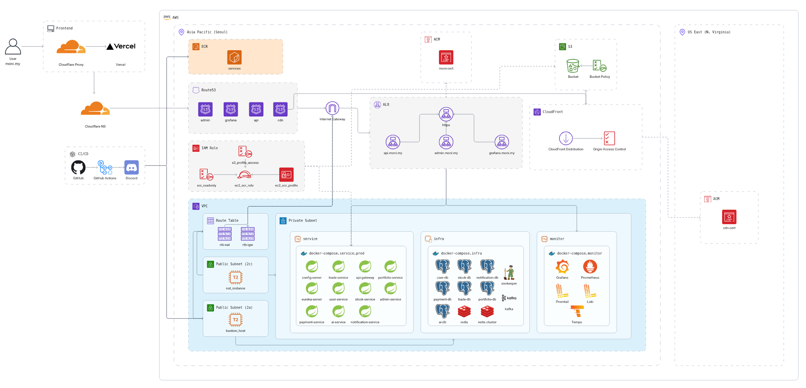

# MONI AWS 인프라 (Terraform)

MONI 프로젝트의 AWS 인프라를 Terraform으로 관리하는 레포지토리입니다.

---

## 아키텍처



### 도메인 구성

| 도메인               | 대상                             | 방식               |
|-------------------|--------------------------------|------------------|
| `api.moni.my`     | 서비스 EC2 — api-gateway :8080    | ALB (호스트 기반 라우팅) |
| `admin.moni.my`   | 서비스 EC2 — admin-service :19097 | ALB (호스트 기반 라우팅) |
| `grafana.moni.my` | 모니터링 EC2 — Grafana :3000       | ALB (호스트 기반 라우팅) |
| `cdn.moni.my`     | S3 프로필 이미지                     | CloudFront CDN   |

- 메인 도메인 `moni.my`: Cloudflare 관리 (프론트엔드)
- 서브도메인: Cloudflare → Route 53 NS 위임
- HTTPS 인증서: ACM SAN (`api` + `admin` + `grafana`) / CloudFront용 ACM (`cdn`, us-east-1)
- HTTP :80 → HTTPS :443 자동 리다이렉트
- Nginx 미사용, ALB 리스너 룰로만 라우팅

---

## EC2 인스턴스 사양

| Name 태그      | 인스턴스 타입    | 서브넷  | 역할                                          |
|--------------|------------|------|---------------------------------------------|
| service      | t4g.large  | 프라이빗 | 앱 서비스 전체 — GitHub Actions CD로 ECR 이미지 자동 배포 |
| infra        | r8g.medium | 프라이빗 | DB, Redis, Kafka                            |
| monitor      | t4g.small  | 프라이빗 | Grafana, Prometheus, Loki                   |
| bastion_host | t2.micro   | 퍼블릭  | SSH 터널링용 (프라이빗 EC2 접근 경유)                   |
| nat_instance | t2.micro   | 퍼블릭  | 프라이빗 서브넷 아웃바운드 인터넷                          |

---

## 모듈 구조

```
moni-infra-terraform/
├── main.tf               # 루트 모듈 (모듈 호출 + Route 53 A 레코드)
├── acm/                  # ACM 인증서 (SAN: api/admin/grafana.moni.my)
├── alb/                  # ALB + 타겟그룹 3개 + HTTPS 리스너 + 호스트 기반 룰
├── cloudfront/           # CloudFront CDN (cdn.moni.my, S3 프로필 이미지)
├── ec2/                  # EC2 인스턴스 5개
├── ecr/                  # ECR 리포지토리 11개 + IAM 역할 + 수명 주기 정책
├── key-pair/             # EC2 키페어
├── route53/              # ACM DNS 검증 레코드
├── s3/                   # S3 버킷 (프로필 이미지 + 로그)
├── security-group/       # 보안 그룹
├── subnet/               # 퍼블릭 2개 / 프라이빗 2개
├── vpc/                  # VPC + IGW + 라우트 테이블
└── docs/
    └── IMG-1.png         # 아키텍처 다이어그램
```

### 모듈 문서

각 모듈의 상세 Inputs / Outputs는 아래 문서를 참조하세요.

| 모듈             | 설명                        | 문서                                                     |
|----------------|---------------------------|--------------------------------------------------------|
| acm            | ACM 인증서 (SAN)             | [acm/README.md](./acm/README.md)                       |
| alb            | Application Load Balancer | [alb/README.md](./alb/README.md)                       |
| cloudfront     | CloudFront CDN            | [cloudfront/README.md](./cloudfront/README.md)         |
| ec2            | EC2 인스턴스 5개               | [ec2/README.md](./ec2/README.md)                       |
| ecr            | ECR 리포지토리 + IAM           | [ecr/README.md](./ecr/README.md)                       |
| key-pair       | EC2 키페어                   | [key-pair/README.md](./key-pair/README.md)             |
| route53        | ACM DNS 검증                | [route53/README.md](./route53/README.md)               |
| s3             | S3 버킷 + IAM 정책            | [s3/README.md](./s3/README.md)                         |
| security-group | 보안 그룹                     | [security-group/README.md](./security-group/README.md) |
| subnet         | 서브넷 (퍼블릭/프라이빗)            | [subnet/README.md](./subnet/README.md)                 |
| vpc            | VPC + IGW + 라우트 테이블       | [vpc/README.md](./vpc/README.md)                       |

문서는 [terraform-docs](https://terraform-docs.io)로 자동 생성되었습니다.

---

## 주요 설정

### ALB 라우팅

```
HTTP :80  → HTTPS :443 리다이렉트 (301)

HTTPS :443
  ├── Host: api.moni.my     → api-target-group     (서비스 EC2 :8080)
  ├── Host: admin.moni.my   → admin-target-group   (서비스 EC2 :19097)
  └── Host: grafana.moni.my → grafana-target-group (모니터링 EC2 :3000)
```

### CloudFront CDN

- 도메인: `cdn.moni.my`
- Origin: S3 버킷 (`profiles/*` 경로만 허용)
- 접근 방식: OAC (Origin Access Control) — S3 퍼블릭 접근 없이 CloudFront 경유
- 인증서: ACM (us-east-1) — CloudFront는 버지니아 북부 리전 인증서만 사용 가능
- 캐시: 기본 TTL 24시간, 최대 1년

### ECR

- 리포지토리 11개: `config-server`, `eureka-server`, `api-gateway`, `user-service`, `trade-service`, `stock-service`, `portfolio-service`, `notification-service`, `payment-service`, `ai-service`, `admin-service`
- 서비스 EC2에 IAM Instance Profile 연결 — 환경변수 없이 ECR pull 가능
- 수명 주기 정책: 서비스당 최근 이미지 **2개만** 유지

### S3

- 버킷: `log-bucket-samzo-moni`
- EC2 IAM 정책으로 `profiles/*`, `logs/*` 접근 허용
- CORS: `https://moni.my` 허용 (PUT 메서드)
- CloudFront OAC로 `profiles/*` 서빙

---

## 적용 순서

```bash
terraform init
terraform plan
terraform apply
```

> ACM DNS 검증 완료까지 최대 **30분** 대기 시간 발생할 수 있음

apply 완료 후 각 EC2 구동:

```bash
# 인프라 EC2 (DB/Redis/Kafka 먼저)
docker-compose -f docker-compose.infra.yml up -d

# 모니터링 EC2
docker-compose -f docker-compose.monitor.yml up -d

# 서비스 EC2 — stage 브랜치 push 시 GitHub Actions CD 자동 배포
```

---

## 예상 월 비용

| 항목                               | 예상 비용     |
|----------------------------------|-----------|
| EC2 service (t4g.large)          | $66.5     |
| EC2 infra (r8g.medium)           | $63.4     |
| EC2 monitor (t4g.small)          | $16.6     |
| EC2 bastion + NAT (t2.micro × 2) | $21.0     |
| ALB                              | ~$20      |
| EBS (기본 8GiB × 5)                | ~$4       |
| ECR (11개 × 2이미지 × ~600MB)        | ~$1.32    |
| CloudFront                       | ~$1       |
| ACM                              | 무료        |
| Route 53                         | $0.5      |
| S3                               | ~$1       |
| **합계 (트래픽 제외)**                  | **~$195** |

> 같은 리전 내 ECR ↔ EC2 데이터 전송 무료 / 월 예산 상한 $200

---

## SSH 접근 (Bastion 경유)

`terraform apply` 후 `key-pair/my_key.pem` 이 생성됩니다.

```bash
# 키 파일 권한 설정
chmod 400 key-pair/my_key.pem

# Bastion → 프라이빗 EC2 접근
ssh -i key-pair/my_key.pem -J ec2-user@<BASTION_IP> ec2-user@<PRIVATE_IP>
```

---

## 주의사항

### 민감 파일 커밋 금지
아래 파일은 `.gitignore` 등록 완료 — 절대 커밋하지 않도록 주의.

| 파일                    | 이유                        |
|-----------------------|---------------------------|
| `terraform.tfstate`   | AWS 리소스 ID, IP 등 민감 정보 포함 |
| `key-pair/my_key.pem` | EC2 SSH 프라이빗 키            |

### 보안 그룹 전 포트 오픈 상태
개발 편의 목적으로 단일 보안 그룹 전 포트 오픈. 프로덕션 전환 시 ALB / 서비스 EC2 / Bastion / 인프라 EC2 각각 분리 필요.

### EBS 용량
기본 8GiB. 서비스 EC2는 ECR 이미지 pull 방식이라 로컬 빌드 없음.

---

